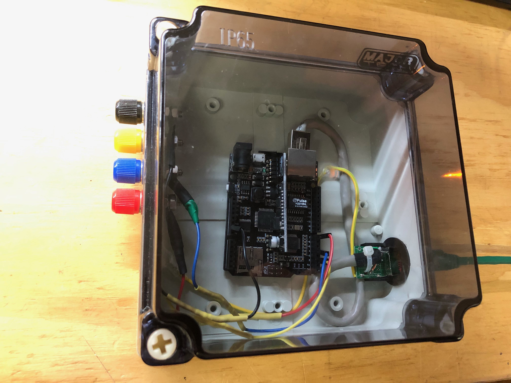

# Generator Monitoring System 'GenMon'
created by Jesse Davids.

### Purpose:
The purpose of this repo is to monitor 2 different states of power, plus 1 fault detection system.
First you have state power, and generator power. These can either be On/Off. The arduino will capture
this information and send it to a **website**, which is hosted on the **web server** made on the arduino in JSON
format.

The arduino gets this info from 4 cold-contact switches on the generator. If one wire touches ground,
that will pull the pin down, resulting in either a 1 or 0. 

#### Example:
State power is always on, so the cold-contact switches make contact, sending a value of 1 to the arduino
website, letting anyone know that state power is on. As soon as the power goes off, it will reflect a 0.

## Contributions
Anyone is welcome to contribute to this project. Much thanks in advance :).

# What you might need.

1. an Arduino, or custom board. I have made this with an ATmega32u4 and Wiznet chip W5500 with active PoE.
[This is the arduino i used, make sure it is PoE ACTIVE if your're going to use it.](https://robotdyn.com/leonardo-eth-v2-with-atmega32u4-ethernet-w5500-arduino-compatible-board.html)
1. 4 wires with **10k resistors** connected in the middle. One of the wires must be connected
to **Ground** on the arduino.
1. 3 banana connectors.
1. Out of the generator should come 4 banana connectors to connect with the arduino.
1. Additionally you should get monitoring software to pull the JSON objects from the website into a graph or whatever you like.

